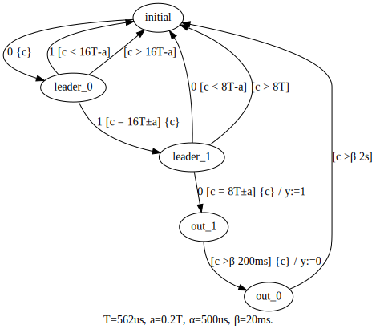

# tathdl

An implementation sketch of a translator from annotated Timed Automata[*1] to VHDL.

Inputs:
1. A timed automaton written in a subset of [Graphviz](https://graphviz.org/)'s dot language, and
2. Clock frequency used for timers

## Setup

```
$ dotnet --version
3.1.101
```
```shell
dotnet restore
```

## Running

```shell
cd ./src/Main
dotnet run <path-to-dot-file> <clock-frequency>
```

## Example

Input | Value
---- | ----
Timed automaton | ../../examples/ir2solenoid/src/fsm.dot (Figure 1.)
Clock frequency | 2.08MHz

fsm.dot:



```shell
dotnet run ../../examples/ir2solenoid/src/fsm.dot 2.08MHz
```

generates [a VHDL code](./examples/ir2solenoid/output/clock2_08MHz.vhd).

## Reference

- [*1] *Timed Automata: Semantics, Algorithms and Tools*, Johan Bengtsson and Wang Yi, 2004, https://www.seas.upenn.edu/~lee/09cis480/papers/by-lncs04.pdf
