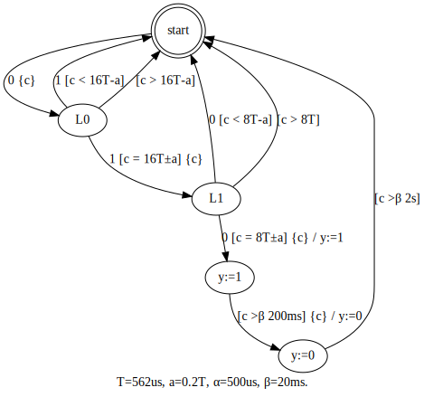

# tathdl

An implementation sketch of a translator from annotated Timed Automata[*1] to VHDL.

Inputs:
1. A timed automaton written in a subset of [Graphviz](https://graphviz.org/)'s dot language, and
2. Clock frequency used for timers

## Setup

```
$ dotnet --version
3.1.302
```
```shell
dotnet restore
```

## Building

At project root,

```shell
dotnet publish -c Release
```

generates `tathdl.{exe,dll}` into `./artifacts/Main/netcoreapp3.1/`.

See also https://docs.microsoft.com/en-us/dotnet/core/deploying/

## Running

Change directory to or add PATH entry of `./artifacts/Main/netcoreapp3.1/`.
Then run the following in a shell (cmd.exe, bash etc.):

```shell
tathdl <path-to-dot-file> <clock-frequency>
```

It outputs VHDL code into stdout.

In case of PowerShell 5.x or older, you may be required to convert UTF-16 LE conding of redirect as follows:

```powershell
# Only when PowerShell 5.x or older
tathdl <path-to-dot-file> <clock-frequency> | Out-File -Encoding ascii out.vhd
```

## Example

Input | Value
---- | ----
Timed automaton | ../../samples/ir2solenoid/src/fsm.dot (Figure 1.)
Clock frequency | 2.08MHz

fsm.dot:



```shell
./artifacts/Main/netcoreapp3.1/tathdl .\samples\ir2solenoid\src\fsm.dot 2.08MHz
```

will generate [a VHDL code](./samples/ir2solenoid/output/clock2_08MHz.vhd) to stdout.

## Running with dotnet cli

```shell
cd ./src/Main
dotnet run <path-to-dot-file> <clock-frequency>
```

## Unit Test

```shell
cd tests/MainTest
dotnet run
```

## Reference

- [*1] *Timed Automata: Semantics, Algorithms and Tools*, Johan Bengtsson and Wang Yi, 2004, https://www.seas.upenn.edu/~lee/09cis480/papers/by-lncs04.pdf
